# ARCHAI — Sovereign Semantic Heritage Infrastructure

> "Museums are not silent repositories of Memory; they are living, thinking organisms, where imagination and knowledge, tradition and innovation meet." — Gayane Umerova, UNESCO, 2025

**Version:** 10.6
**Author:** Rob Graham · FAMTEC (Fine Art Media Tech) / RMIT University
**Status:** Working prototype — multi-institution semantic search + LLM object chat + NFC visitor pages
**Target:** ISEA2026 Dubai, 6th Summit on New Media Art Archiving (April 11–12)
**Paper:** `docs/ARCHAI_ISEA2026_Rob_Graham.pdf`
**Licence:** © Rob Graham 2026. All rights reserved until further notice. (code) · CC BY 4.0 (MV data) · CC0 (Met data) · V&A Open Access

---

## What's Working Right Now

### ✅ Multi-Collection Semantic Search
Three museum collections in Qdrant, searchable simultaneously:

| Collection | Source | Objects | Licence | Status |
|-----------|--------|---------|---------|--------|
| `archai_pilot` | Museums Victoria | ~80 | CC BY 4.0 | ✅ Live |
| `archai_met` | The Metropolitan Museum of Art, NYC | ~150 | CC0 | ✅ Live |
| `archai_va` | Victoria and Albert Museum, London | ~150 | V&A Open Access | ✅ Live |

- Query → embedded via nomic-embed-text → vector searched across all 3 collections → results merged by cosine similarity
- Results colour-tagged: MV (teal), Met (gold), V&A (purple)
- Text fallback when Ollama offline
- Sort by: name, date, discipline, source
- Filter: with images (default), all, MV/Met/V&A only
- Deduplicated by canonical_id across collections

### ✅ Object-as-Speaker LLM Chat
Each object speaks in first person via llama3, grounded in verified metadata:
- System prompt built from ALL metadata fields
- Dynamic institution name per object
- Hallucination prevention: "That's not in my record"
- Metadata fallback when Ollama offline — no LLM required

### ✅ Object Detail Panel
- Full metadata, image, curatorial description
- Live llama3 chat with question chips
- Semantically related objects across all collections
- Source-specific links: "View on The Met →", "View on V&A →"

### ✅ NFC Visitor Pages (Mobile)
200 standalone HTML pages from all 3 collections:
- Object image, metadata, description, LLM chat over LAN
- Share: native iOS sheet, email, copy link, X/Twitter
- Persistent comments via localStorage
- Related objects with cross-collection links
- Captive portal for exhibition WiFi

### ✅ NFC Management Panel
- Tags from objects with images, mixed across MV/Met/V&A
- 3-column layout: tag list → editor → phone preview
- Search, filter, publish/unpublish

### ✅ Role Switcher
| Role | Access |
|------|--------|
| Admin | All tabs |
| Curator | Curator, Nodel, NFC, Vocab, Visitor, FAMTEC |
| Collections | Curator, NFC, Vocab, Visitor, FAMTEC |
| Technician | Nodel, Visitor, FAMTEC |
| Volunteer | Curator, NFC, Visitor, FAMTEC |
| Visitor | Visitor only |

### ✅ FAMTEC Exchange
- Test space for interaction design, workflow feel, and interface prototyping inside ARCHAI
- Placeholder institution names are used to simulate exchange activity and help evaluate the app experience
- Feed includes loan, rental, skills, and crew-availability scenarios
- Chip filters and institution chat are currently prototype interactions only
- This is not the final FAMTEC platform: production development will be handled separately by FAMTEC outside the PhD work, with potential later integration into ARCHAI once developed

### ✅ Nodel Panel
- Gallery cards with status indicators
- Node table, fault log, schedule
- Emergency stop

### ✅ Vocabulary & Thesaurus
- AAT, Local, LCSH, TGN panels
- Term search, broader/narrower hierarchy
- Indigenous protocol layer

## Screenshots

Desktop views:

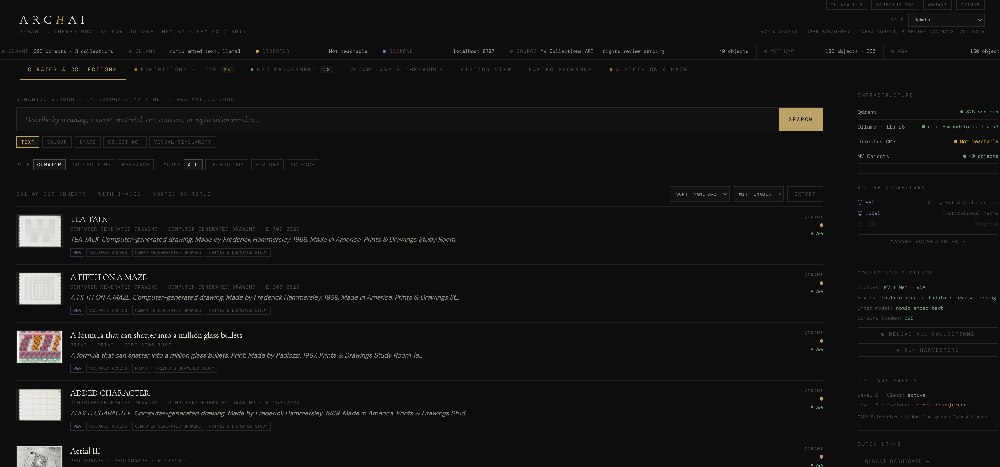
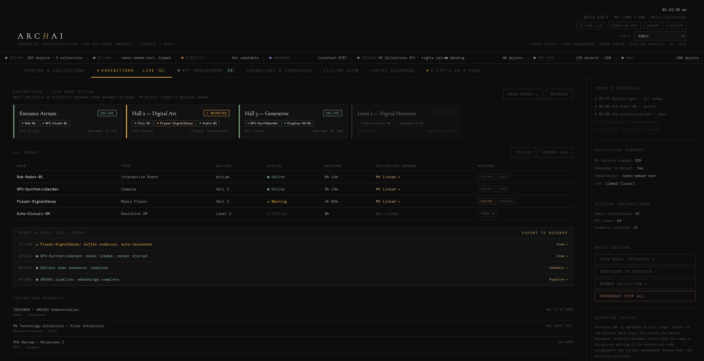
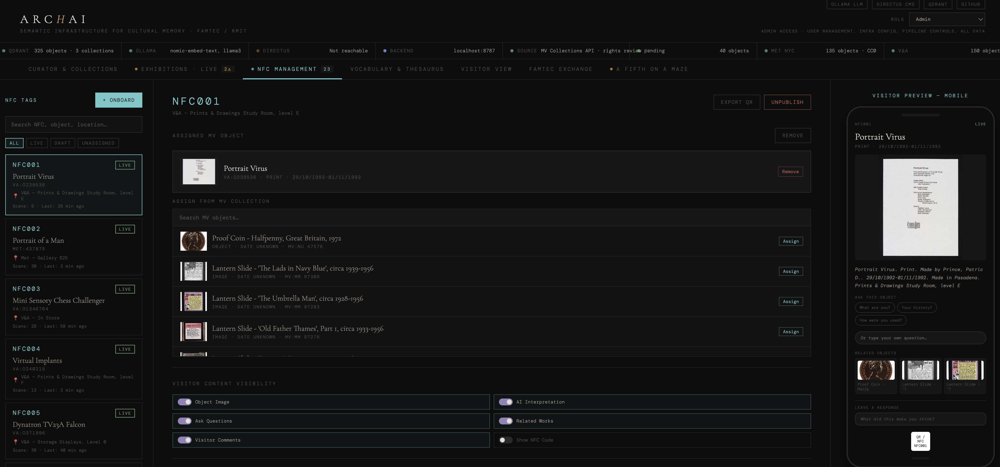
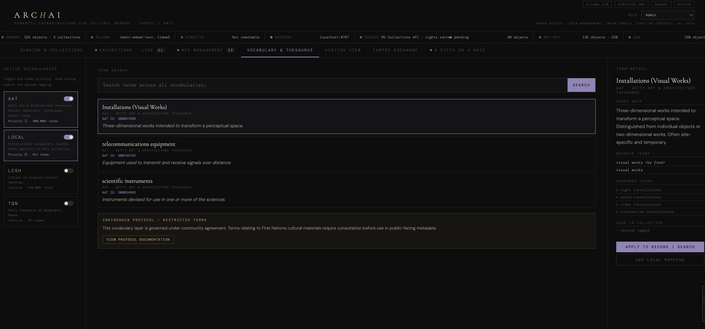
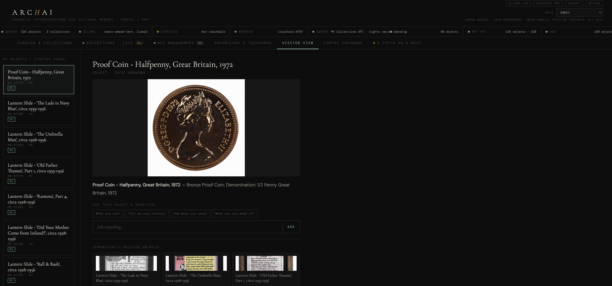
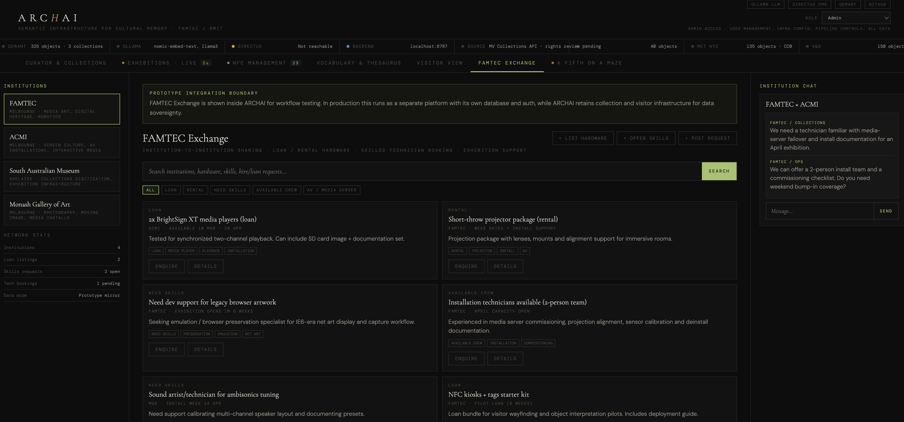
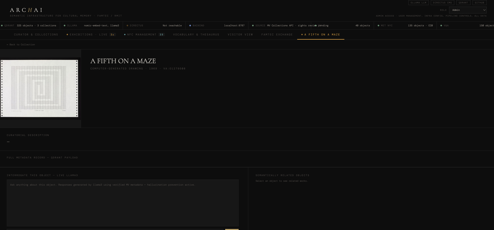
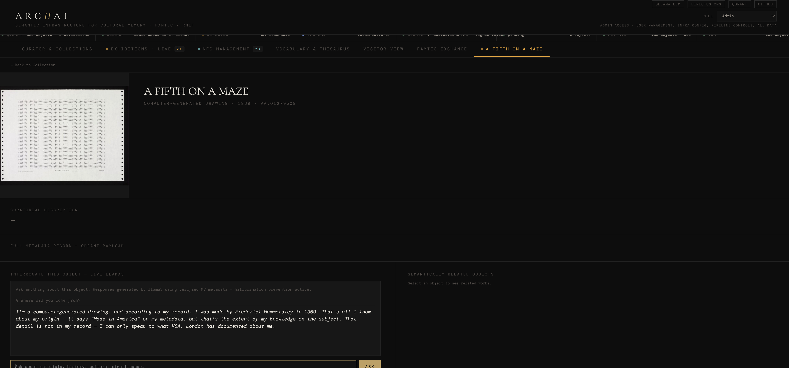

Mobile views:

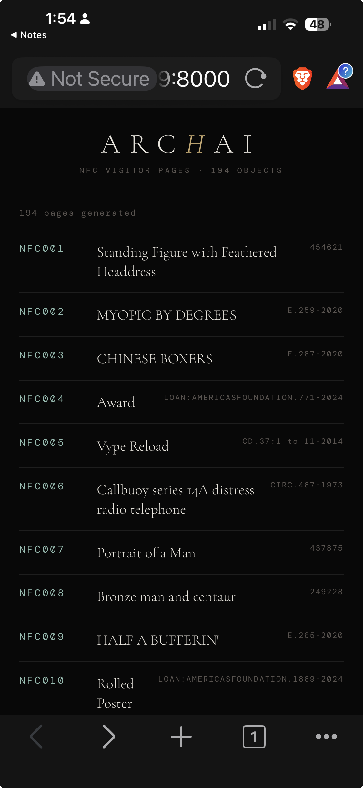
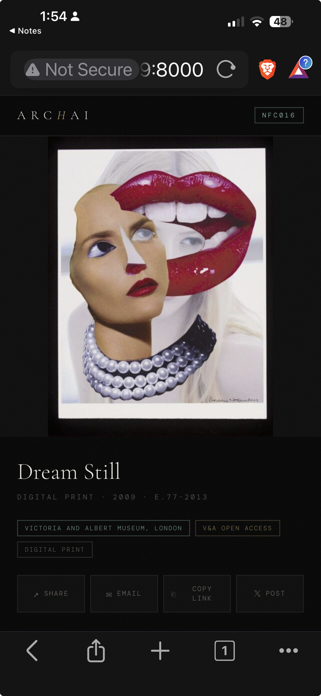
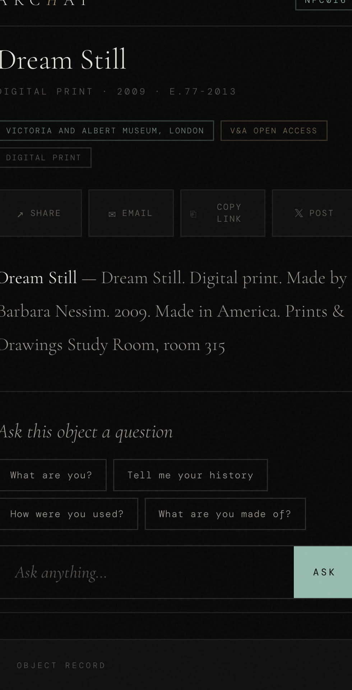
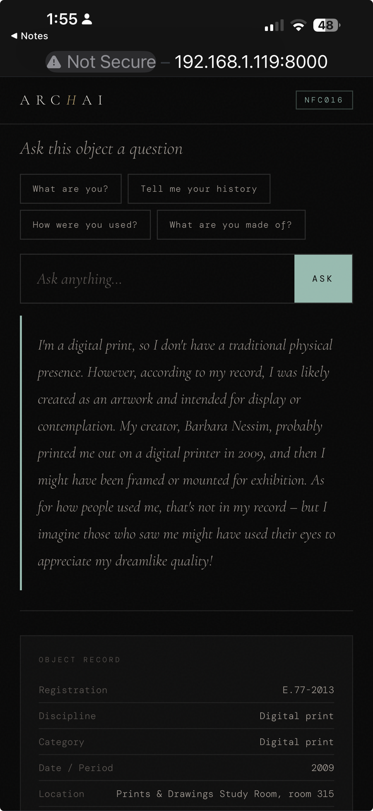
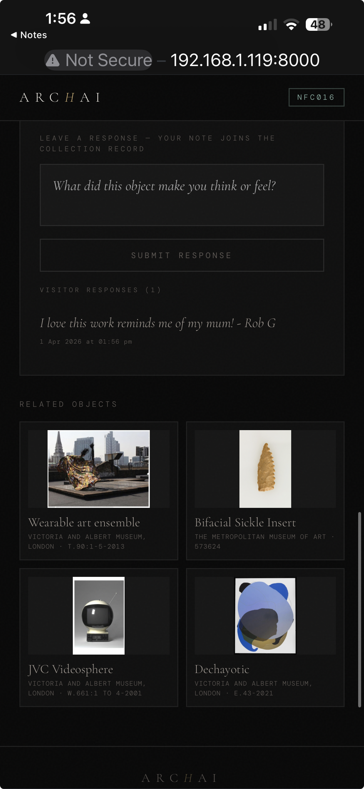
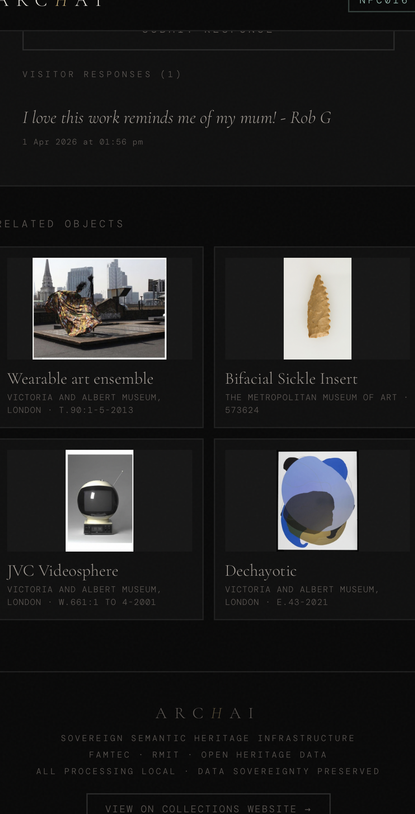

---

## What's Not Working Yet

### 🔲 Cross-Collection LLM Intelligence (RAG)
LLM currently only sees one object's metadata. Needs RAG: embed user question → search Qdrant → inject related objects into LLM context → synthesise connections. Curators get full cross-collection access, visitors get bounded single-object responses.

### 🔲 LLM Image Analysis
Use llava to extract colours, text, objects from images → searchable metadata.

### 🔲 Thesaurus Backend
AAT lookup API, auto-tagging. Currently UI prototype with static data.

### 🔲 FAMTEC Persistence
Current in-app FAMTEC Exchange uses prototype data and in-memory arrays only. The production FAMTEC Exchange platform will be developed separately by FAMTEC outside the PhD work, with potential later integration into ARCHAI once developed.

### 🔲 NFC ↔ Curator Link
Curator panel doesn't link to NFC pages yet. Pages generated separately.

### 🔲 Directus Integration
Health-checked only. Not used for data operations.

### 🔲 Nodel API
Static prototype data. Needs WebSocket to real Nodel instance.

### 🔲 Harvester Improvements
Date extraction from titles, better Met filtering, incremental harvest.

---

## Architecture

```text
┌──────────────────────────────────────────────────────────┐
│                    ARCHAI Frontend                      │
│                 (ARCHAI_v10_6.html · browser)           │
│                                                         │
│  Search ──→ Ollama embed ──→ Qdrant (3 collections)     │
│  Chat   ──→ Ollama llama3 ──→ grounded response         │
│  NFC    ──→ Ollama llama3 ──→ chat over LAN             │
│  Sort   ──→ client-side on loaded objects               │
└────────┬──────────────┬──────────────┬──────────────────┘
         │              │              │
    localhost:6333  localhost:11434  localhost:8055
      Qdrant          Ollama        Directus (optional)
```

---

## Project Structure

```text
archai/
├── ARCHAI_v10_6.html              ← Main frontend (current)
├── README.md                      ← This file
├── start-demo.sh                  ← One-command startup
├── DEMO_CHEAT_SHEET.md
├── backend-archai/scripts/
│   ├── mv-harvester.js            ← Museums Victoria → Qdrant
│   ├── met-harvester.js           ← Met NYC → Qdrant
│   └── va-harvester.js            ← V&A London → Qdrant
├── nfc-pages/
│   ├── generate-nfc-pages.js      ← All collections → HTML per tag
│   ├── nfc-visitor-template.html  ← Mobile template
│   ├── captive-portal.html
│   └── v/                         ← Generated pages (not in git)
├── docs/
│   └── ARCHAI_ISEA2026_Rob_Graham.pdf
└── docker-compose.yml
```

---

## Quick Start

```bash
cd ~/archai && ./start-demo.sh
```

Starts Docker, Qdrant, Ollama (with LAN+CORS), checks NFC pages, prints URLs, serves on port 8000.

**Main app:** http://localhost:8000/ARCHAI_v10_6.html
**NFC index:** http://localhost:8000/nfc-pages/v/
**Phone:** http://LAN_IP:8000/nfc-pages/v/NFC066.html

---

## Hardware

Mac Studio M2 Max · 64GB · 1TB. Base institutional deployment: ~$3,500–5,000 USD one-time. No subscriptions, no cloud dependency.

---

## Version History

| Version | Changes |
|---------|---------|
| v6 | Initial prototype, mock objects |
| v7 | Role switcher, FAMTEC, Nodel, NFC, vocabulary |
| v10.4 | MV-only, live Qdrant + Ollama, LLM chat |
| v10.5 | Restored all panels, NFC page generator |
| **v10.6** | **Multi-collection (MV+Met+V&A), sort/filter, dedup, harvesters, NFC share+comments, 200 pages, dynamic institutions** |

---

Rob Graham · FAMTEC / RMIT · rob@fineartmedia.tech
GitHub: github.com/rob-e-graham/archai
