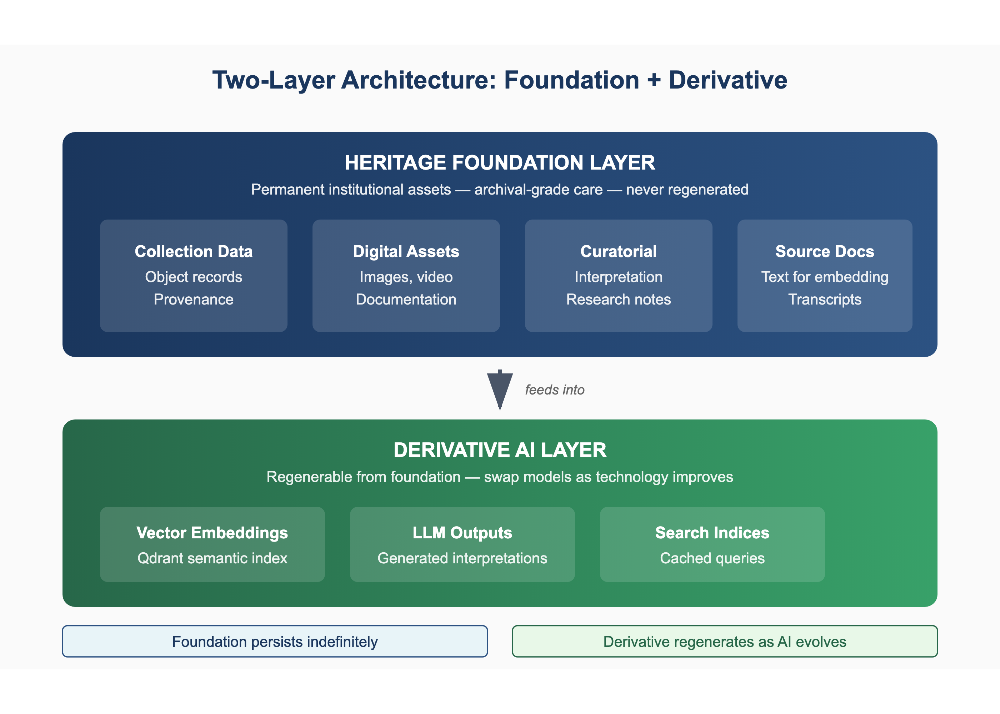

# ARCHAI: Cultivating a Living Archive
## Sovereign AI Infrastructure for Cultural Heritage — A Deep White Paper (v2)

**Rob Graham** — PhD Researcher (Design), RMIT University, School of Design ·
Founder, FAMTEC (Fine Art Media Tech)
rob@fineartmedia.tech · fineartmedia.tech/archai · github.com/rob-e-graham/archai
Draft, June 2026. Companion to the accepted paper *ARCHAI: Cultivating a Living
Archive* (#999, 6th Summit on New Media Art Archiving, ISEA2026 Dubai). Situated
in doctoral research conducted through and with the National Communication Museum,
Melbourne, on the lands of the Wurundjeri Woi-wurrung people of the Kulin Nation.

> *"Museums are not silent repositories of Memory; they are living, thinking
> organisms, where imagination and knowledge, tradition and innovation meet."*
> — Gayane Umerova, UNESCO Global Dialogue on AI and the Future of Museums, 2025

---

## Abstract

ARCHAI is a sovereign, open-source semantic interface layer for cultural heritage:
a system that sits above an institution's existing collection- and asset-management
systems and adds conversational search, object-level visitor interpretation,
rights-aware reuse, multilingual access, and staff-facing collection intelligence —
while running entirely on hardware the institution owns, with no collection data
leaving the building. It is developed as **practice-based design research** through
Research through Design cycles, situated in a working museum, and it makes its own
construction a research instrument. Every generated statement is bounded by
**Obtext** (Object + Context + Evidence): a structured, per-object body of verified
evidence from which the AI reasons and beyond which it will not speak. A two-layer
architecture separates a permanent heritage foundation from a regenerable AI layer;
a five-layer hallucination-prevention framework, ingest-time rights and
cultural-safety gates, and explicit curatorial-authority mechanisms make the system
trustworthy enough for institutional use.

This paper positions ARCHAI against the emerging field — including the Accademia
Carrara's ungrounded ChatGPT gallery deployment and the Met's ENCODED guerrilla
project — and argues that the sector's critiques of corporate AI are answered most
convincingly not by another framework but by a working, ownable alternative. It
grounds the design contribution in the HCI canon — from Shneiderman's direct
manipulation and Norman's conceptual models to Dourish's embodied interaction,
Suchman's situated action, the Thing Theory / actor-network account of object
agency, and the more-than-human turn — and develops three contributions the
conference paper could only gesture at: **ethics as architecture** (moving
responsible-AI principles from policy into enforced, auditable properties of the
system); **radical transparency about building with agents** (a documented
multi-agent development method whose coordination record is primary research data);
and a **federated "torrent archive"** in which sovereign nodes hold their own
cultural memory and choose what to share — sovereign by default, connected by
choice. It further maps ARCHAI's fit with the standards institutions already expect
(Dublin Core, IIIF, SPECTRUM) and the research-ethics pathway that governs its move
into public testing. A working public demonstration runs 1,402 conversational
objects across eleven institutions on five continents, every object openly licensed,
on a single local machine.

---

## 1. Introduction: The Alternative Is the Argument

Every major cloud provider now has a prepared pitch for cultural institutions. When
a museum tries to "do AI," it is funnelled into a hyperscaler's managed service
within a few clicks; its collection data leaves the building, its visitor
conversations are logged on someone else's servers, and its interpretation of its
own objects becomes dependent on a subscription that can change without notice.
Companies now sell "sovereign AI" as a product category — sovereign clouds,
sovereign factories — turning a genuine need into a commodity. That is not
sovereignty; it is a landlord painting the door a different colour.

The field is active. Recent work addresses conversational AI in museums (ACM IMX,
EVA London, ACM IUI), critical curation and "mutant archives," the commodification
of AI sovereignty, and data governance for GLAM. But almost all of it is either
corporate product or theoretical critique. Very little of it *builds* a local-first,
zero-dependency alternative that an institution can actually own and run, and none of
it takes objects out of the institution and into the street as autonomous
conversational agents.

ARCHAI is that alternative, and the alternative is the argument. This is
practice-based doctoral research: not a theory illustrated by a prototype, but a
working system whose construction *is* the research. While the field publishes
critiques of corporate AI and proposes theoretical frameworks for sovereignty, this
project runs a working system on a single consumer machine that costs little, depends
on nobody, and lets a person talk to a two-thousand-year-old object in their own
words. The criticism is the thing that was made.

Three problems converge, and ARCHAI answers all three at once. **Access:** most
collections are surfaced in single-digit percentages, invisible to the public and
hard to navigate even for staff. **Sovereignty:** for a public institution,
dependence on external AI is a preservation risk, not merely an ethical preference.
**Trust:** confabulation — plausible falsehood in an authoritative voice — is a
curatorial failure no software update repairs.

---

## 2. Related Work: Positioning ARCHAI in the Field

A field-sensitive review of recent HCI and cultural-computing literature (ACM CHI,
DIS, TEI, JOCCH, IMX, IJHCI and adjacent venues, 2021–2026) locates ARCHAI precisely:
aligned with the field's stated needs, and distinct in its architecture and its claim.

**Conversational AI in museums.** Conversational access to collections is a
fast-rising theme. Wang et al. (2025, University of Technology Sydney and the
Australian Museum) build a natural-language agent over roughly 1.7 million life-science
records, pairing an interactive map with a cloud LLM (GPT-5-mini) that queries a live
biodiversity API. Su et al. (2025, HKUST) present *SimViews*, a multi-agent system in
which LLM agents with professional identities (ethicist, art historian, biologist)
simulate visitor-to-visitor conversation about an artefact. Engström and Løvlie (2025)
use a large language model as design material for a museum installation and confront
the field's central tension — engagement versus misinformation — proposing two
responses: foreground personal narrative over factual accuracy, or deliberately expose
the chatbot's unreliability as a critical-thinking prompt. Evaluations converge on a
warning: an IMX 2025 study of a gallery generative-AI chatbot finds visitors engaged
but left with "a lingering sense of unease"; a JOCCH 2025 evaluation across three
exhibitions finds real potential but persistent problems with "authenticity and
historical accuracy given LLMs' tendency to hallucinate"; the *Artistic Chatbot*
(CIKM 2025) grounds a voice-to-voice system in exhibition material via retrieval;
and the Nikola Tesla chatbot (Vartiainen and Tedre, 2020) impersonates a historical
figure.

ARCHAI is positioned distinctly against all of these. Where Wang et al. depend on a
commercial cloud model and live API, ARCHAI runs a local model over pre-embedded
vectors — the sovereignty models are opposite. Where *SimViews* stages diversity
through *simulated human visitors*, ARCHAI gives the *object itself* a first-person
voice, with diversity coming from interpretive lenses and the visitor's own questions.
And where Engström and Løvlie choose between accepting unreliability and avoiding
facts, ARCHAI takes a third path they do not consider: strict grounding in the
object's institutional record via the five-layer hallucination-prevention framework,
which permits interpretive personality while enforcing factual boundaries. The
"lingering unease" the field reports is precisely what auditable grounding is meant to
answer.

**Tangible, embodied and more-than-human heritage interaction.** The most
comprehensive recent survey (*Smart Objects and Replicas*, JOCCH 2024) argues that
screen-based devices "disengage visitors from the objects, their materiality and the
physicality of the visit," and identifies smart objects — originals or replicas
augmented with computation — as the strongest approach to preserving the material
encounter. This directly supports ARCHAI's design principle that the phone is a
*conversational channel to the object*, not a replacement for looking at it. NFCSense
(CHI 2021) shows commodity NFC can support far richer interaction than "tap to open a
link," pointing to future gesture extensions; and TEI work on natureculture probes
(2025) and postcolonial more-than-human interaction (2024) situates object voice
within a live more-than-human trajectory that ARCHAI's collections from formerly
colonised regions must engage responsibly.

**Affect.** A rising strand treats emotion as a primary mechanism rather than a side
effect: an IJHCI 2025 study of VR at the Hani Rice Terraces finds emotional arousal
the strongest predictor of heritage-identity enhancement; a SAGE Open 2025 paper
argues for a Spinozan concept of *affect* as a richer foundation for design than user
satisfaction; and empirical work (2025) shows interaction modality shapes emotional
engagement. In this light, ARCHAI's interpretive-tone profiles are an affect-design
layer — a decision about what *kind* of encounter the visitor will have — and voice
output adds a further affective register that reading cannot.

**Accessibility.** A systematic review (IJHCI 2026) finds generative AI newly deployed
for blind and low-vision museum access through audio description and navigation, and a
2025 study finds tangible, audio-first interfaces outperform automated or screen-based
alternatives on user control and perceived independence. ARCHAI's speech input and
read-aloud output, multilingual by default, and NFC trigger (no screen required for
the primary interaction) sit squarely within this evidence.

**Sovereign AI.** Sovereignty is rising sharply across industry and policy — the EU's
AI Factories initiative, Indigenous data-sovereignty movements, and the specific
observation that self-hosting Whisper keeps audio entirely on institutional hardware.
ARCHAI is sovereign *by architecture* rather than by policy: a local model, a local
vector database, and a local speech stack mean no collection data or visitor
interaction leaves the building.

**What the field is asking for, and what ARCHAI provides.** Across this corpus the
field's needs recur: *auditable grounding* against hallucination; interaction *beyond
the screen* that preserves the material encounter; *multilingual* access;
*sovereignty* and data governance; attention to *affect*; and a practical
operationalisation of *object agency*, which remains richly theorised (Thing Theory,
actor-network theory, more-than-human design) but barely built. ARCHAI answers each,
and — as far as the surveyed literature shows — is **the first working system to give
heritage objects a first-person conversational voice, grounded in their institutional
records, running on sovereign infrastructure, with hallucination prevention.** It also
inverts a guerrilla precedent — where the Met's ENCODED project (2025) staged
intervention *inside* the museum, ARCHAI extracts objects *outward* into public space
(Section 19) — and operationalises Beiguelman's "mutant archive" (2025) as a
curatorially-reviewed community-contribution layer (Section 13). The gap it occupies
is precise: nobody is building local-first, zero-dependency, ownable cultural-AI
infrastructure, and nobody is putting grounded, sovereign conversational objects into
the street.

---

## 3. Background and Related Work

ARCHAI stands on several convergent bodies of work. The **connecting-archives
agenda** from prior Summits on New Media Art Archiving — Strauss and Fleischmann's
archives as *thinking spaces*, Carroll's mapping of sector AI applications,
Kobayashi's computational-preservation strategies, Rossenova and Wong's federation
agenda, and the ZKM Workshop's requirements for sustainable, federated infrastructure
— frames the sector problem. **Media archaeology** grounds the architecture: Ernst's
distinction between the *cultural archive* (interpretive authority) and
*technomathematical storage* (computational operation); Kirschenbaum's *forensic
materiality*; Rinehart and Ippolito's medium-independent preservation. The
maturation of **local models** (Ollama, open-weight Llama and Qwen families) and
**open vector databases** (Qdrant) is the technical precondition that makes a
sovereignty thesis practical rather than aspirational. **Data governance** draws on
the CARE Principles for Indigenous Data Governance and the Local Contexts /
Traditional Knowledge Label frameworks. And uniquely, ARCHAI reaches past digital
heritage practice to the **origins of Western rhetoric** (Section 5).

---

## 4. Design Research and HCI Methodology

This research is situated within the tradition of **practice-based research**. The
distinction Candy (2006) draws between practice-based and practice-led research
matters here: this is practice-*based* — the creative artefact (the working system)
is itself the basis of the contribution to knowledge, and the outcomes are
demonstrable in and through the artefact. **Research through Design** (RtD) supplies
the operational method: drawing on interaction-design research (Zimmerman et al.,
2007; Wensveen, 2005), the work proceeds through iterative cycles of designing,
prototyping, deploying and reflecting, in which each prototype is a documented
finding rather than an illustration of a prior theory.

Three methodological commitments distinguish the project.

**Building is the research.** The architectural decisions made under real
institutional constraint, and the frameworks that only become clear through friction
with actual collections and actual objects, are the findings. The system was
developed *through and with* a working museum (the National Communication Museum),
whose staff and volunteers provided feedback on prototypes and shared their own
experiences of the collection.

**Version control as methodology.** The commit history is treated as a research
journal: a time-stamped, inspectable record of what was tried, when, and why. Git is
not merely a tool for the work; it is documentation *of* the practice — receipts that
the making is answering specific research questions.

**Conversational development at speed.** The project uses AI agents as design
material and creative partners, and documents that use openly (Section 17). Where the
closest neighbouring work (Engstrøm and Løvlie, DIS 2025) used a cloud model in an
institutional setting, this practice is local, sovereign, independent, and fast — a
field report from inside a practice that builds, rather than a proposal about building.

---

## 5. Theoretical Framework: The Inverse Memory Palace

ARCHAI has a lineage extending not to the emergence of digital heritage practice but
to the origins of rhetoric.

**The method of loci.** The memory palace, codified by Simonides of Ceos
(c.556–468 BCE) and documented by Cicero and Quintilian, treats memory as most
reliable when anchored to physical location. Cicero's formulation — *"it is chiefly
order that gives distinctness to memory"* — makes the palace working epistemic
infrastructure, not decoration. Lynne Kelly shows the same spatial memory systems
developed independently across Indigenous oral traditions worldwide. ARCHAI proposes
a precise inversion: in the classical palace a person uses architecture as a device
for knowledge held internally; in ARCHAI the architecture — the collection itself —
uses AI to share *its* knowledge with visitors moving through it. Each access point
is a locus; each object is its own bounded epistemic domain; the building has already
done the remembering, and it speaks. Knowledge flows outward, from objects to
visitors, rather than inward. The **inverse memory palace**: two and a half millennia
of practice arriving at a vector database.

**Prosopopoeia and the end of the label.** We have a long rhetorical tradition for
giving objects voice — prosopopoeia, speaking statues in Roman forums — and yet we
arrived at eighty words on a card that nobody reads. The museum label is a failed
technology for cultural communication: it speaks *about* the object, never *as* the
object. ARCHAI's conversational objects are the computational heirs of prosopopoeia,
with one constraint the ancient orator never faced. A character in Ovid can say
whatever the narrative requires; ARCHAI cannot. Each object speaks from its verified
record and from nowhere else. When the object speaks for itself, the power dynamic
shifts — from institution-tells-visitor to visitor-asks-object — and people ask
questions they would never ask a curator: *"How were you made?" "What was it like
being buried for a thousand years?"*

**Obtext as the epistemic ground.** The bridge from ancient technique to contemporary
system is a data format: **Obtext** (Object + Context + Evidence) — a cultural object
with its context intact, the trusted body of evidence from which an AI interprets an
object without inventing. *A prompt tells an AI what to do; an Obtext tells it what it
knows.* Every conversation begins with the institution's own records, and where the
evidence runs out, the object says so.

---

## 6. Interaction-Design Lineage: What ARCHAI Keeps, Breaks and Extends

As a design-research contribution, ARCHAI must be legible not only against recent
cultural-computing papers but against the foundational traditions of human-computer
interaction. It keeps some of their principles, deliberately breaks others, and
extends a third set into new territory.

**Direct manipulation (Shneiderman).** Shneiderman's Eight Golden Rules — consistency,
universal usability, informative feedback, closure, error prevention, reversibility,
user control, reduced memory load — remain the most widely taught usability
principles. ARCHAI honours several: a canonical record gives every object structural
consistency across eleven source institutions; speech input and output, multilingual
responses and tone controls serve universal usability; voice-capture status and
per-object rights indicators give informative feedback; the object's record stays
visible beside the conversation, reducing memory load. But it deliberately breaks two.
**Reversibility** does not apply — an encounter with an object cannot be "undone";
heritage interpretation is not a transaction. And total **user control** is refused on
purpose: the visitor chooses the question, language and tone, but not the
interpretation. The object has its own grounded voice. A response of *"that's not in
my record — but ask me about…"* is not an error state to be prevented; it is a
designed conversational move.

**Affordances and conceptual models (Norman).** The NFC tap, QR scan or printed poster
is a direct Norman affordance: no menu, no search, no account — the tap *is* the
interface. ARCHAI's most interesting departure is at the level of the conceptual
model. The visitor's model is simple and emotionally engaging — *"I am talking to this
object"* — while the system's reality is a semantic query against canonical records
with a grounded language model. Norman assumes good design makes the mechanism
transparent; ARCHAI argues that in a heritage encounter a *productive fiction* is
desirable, and that trust is earned not by exposing vector search but by grounding
every claim in the record and saying so.

**Embodied and situated interaction (Dourish, Suchman).** Dourish's embodied
interaction is ARCHAI's closest theoretical anchor. The visitor stands before the
physical object; the phone is a conversational channel to it, not a screen that
replaces it; meaning emerges *through the encounter* rather than being pre-given on a
label; and voice adds a further embodied register. ARCHAI extends embodied interaction
from manipulation (Dourish's tangible tokens) to **dialogue**: the object is not
manipulated but addressed. Suchman's situated action explains why ARCHAI is neither an
audio guide nor a scripted chatbot: the response depends on what the visitor noticed,
where they are standing, who they are with and what they ask in the moment —
interpretation generated *in situ* from verified data, not retrieved from a plan.

**Object agency (Brown, Latour) and more-than-human design.** ARCHAI operationalises
Thing Theory and actor-network theory in a working system rather than a thought
experiment: objects are treated as *things* with voice and interpretive position
rather than as data rows, and as *actants* that actively shape what a visitor learns
and asks next. Crucially it sits with Brown rather than pure object-oriented ontology
— the human visitor is never eliminated; the encounter is relational. This places
ARCHAI within the contemporary more-than-human design movement (the Design Museum's
2025 *More than Human*; the DRS and Design+Posthumanism work of 2024) while refusing
anthropomorphism: an object speaks from its material reality — medium, age, provenance,
culture — so a ceramic bowl and a military uniform speak differently, and the system
distinguishes four registers (accessibility narration, curatorial interpretation,
public-guide voice, and performative object voice) that carry different kinds and
degrees of agency.

**Digital repatriation and data sovereignty.** Finally, the sovereignty thesis is not
only technical convenience but a design-ethical position aligned with the
digital-repatriation and Indigenous-data-sovereignty discourse (CARE; Local Contexts /
TK Labels; the 2024–2025 restitution debates). Local-first architecture, per-object
cultural-protocol gates, preserved source records and multilingual access are the
means by which a source community can retain authority over how its heritage is
described, accessed and voiced. Sovereignty by architecture, not by policy.

The combination — a sovereign local model, semantic search over canonical heritage
metadata, physical-digital bridging, a grounded first-person object voice,
hallucination prevention, per-object legal and cultural gates, and multilingual speech
— does not appear, as a single working system, anywhere in the 2021–2026 HCI,
museum-informatics or heritage-technology literature surveyed for this research.

---

## 7. The Access Crisis

Only about two percent of a typical museum's collection is on display. The other
ninety-eight percent sits in storage, accessible to those who know the right
catalogue codes and the right person to email. This is not a logistics problem but a
gatekeeping one: arcane search interfaces and specialist terminology are themselves a
form of narrative control. Imagine your grandmother's sewing machine is in a
collection; you do not know its accession number, only that it existed. Access, in
any meaningful sense, means being able to describe it in your own words and find it
without speaking the institution's language.

The crisis also runs the other way, inside the institution: legacy cataloguing,
terminology that shifts across decades of staff, and objects filed by material or
donor rather than meaning. The object's real history — its relationships, and the
love, reverence and connection it carries — is largely absent from the catalogue,
which records only the surface. And the sector's response to access risks widening
inequity: AI sold on deep budgets and subscriptions creates a world of haves and
have-nots. ARCHAI's answer is a stack an under-resourced institution can own and run.

---

## 8. Architecture: The Semantic Interface Principle

ARCHAI is not a collection-management system and not a digital-asset-management
platform. It is a semantic interface layer that sits above whatever systems are in
place — CollectiveAccess, EMu, Axiell, Vernon, TMS, ResourceSpace — connecting via
their APIs, normalising metadata and assets, transforming them into vector
representations, and loading them into a vector database. The institution does not
migrate and does not replace anything.

The central architectural contribution is a conceptual distinction between two
layers. The **heritage foundation layer** comprises permanent institutional assets —
collection data, curatorial interpretation, organisational knowledge, documentation —
managed, backed up and governed as intellectual property with preservation-grade
requirements. ARCHAI reads from it and never writes to it. The **AI processing
layer** — vector embeddings, model weights, pipelines, generated responses — is
explicitly derivative and replaceable, understood as a transient product of current
technology that can be rebuilt from foundation data as technology evolves, ensuring
the institution is never locked into a specific AI implementation. This mirrors
Ernst's distinction between the cultural archive and technomathematical storage, and
directly addresses the sustainability requirements articulated at the ZKM Workshop.
A one-directional editorial pathway sits between the two, carrying curator-authored
interpretation outward to visitor surfaces without ever writing back into the archive.

**The stack.** Ollama for local inference, Qdrant for vector storage, a retrieval-
augmented-generation pipeline (LlamaIndex) managing chunking, embedding, routing and
synthesis, and nomic-embed-text for embeddings. Chunking strategies are developed for
heritage content: structured records parsed to preserve field relationships,
curatorial texts segmented at semantic boundaries, technical documents chunked for
procedural coherence. The system is **model-agnostic** — staff-facing interrogation
favours a larger model for precision and cross-referencing; visitor-facing objects
favour a smaller, faster model for personality and tight adherence to bounded
metadata — with model-swapping a configuration decision, not an architectural
constraint.

---

## 9. Obtext and the System-Prompt Pipeline

Each object's Obtext organises what it can and cannot say into four categories:
**verified facts** it may assert (date, materials, provenance region, function,
context); **unknown fields** it must acknowledge rather than fill (manufacturer,
original owner, service history); **curator-approved statements** it may use verbatim,
carrying curatorial authority into the conversation; and **prohibited statements** it
must never make (named individuals, particular events, invented memories).

**Example — the Sound Burger.** An Audio-Technica AT-727 Sound Burger (1983) operates
within a bounded world. A visitor asks: *"My dad used to take one of these to parties
in Footscray — did you ever play at one?"* A poorly designed system invents a memory;
the visitor leaves with a false one. ARCHAI answers honestly that it cannot know where
it has been, honours the connection without fabricating — *"even if it wasn't me
spinning, we're the same machine; what was he playing?"* — and stays in character. In
adversarial testing, the object consistently held its boundaries, acknowledged gaps,
and resisted prompts designed to provoke confabulation.

---

## 10. Curatorial Authority in AI-Mediated Interpretation

A distinctive contribution is a set of mechanisms that keep curatorial authority
intact while AI amplifies its reach. These operate at several levels: **source
prioritisation** weights institutional documentation above external information;
**response framing** maintains institutional voice and perspective; **boundary
enforcement** prevents responses on topics outside institutional expertise; and
**review workflows** enable curatorial oversight of outputs. Authority here does not
mean every response requires sign-off — that would eliminate the scalability of
AI-mediated interpretation. Rather, curators define the knowledge foundations,
interpretive frameworks and response boundaries within which the system operates. The
AI amplifies curatorial reach without replacing curatorial judgment.

---

## 11. Interface Development and Inclusive Interaction

ARCHAI's interfaces are the product of iterative HCI design across multiple channels.

**AUXIO — the object in the visitor's hand.** *ARCHAI User eXperience: data In, data
Out.* An NFC tap, QR scan, hyperlink, map or spatial trigger on or beside an artefact
opens the AUXIO chat interface on the visitor's own device; the object speaks as
that specific object, from its verified record, with a clear sense of what it does and
does not know. Access is method-agnostic, with no app to install and no account to
create. Distinct voice lenses serve distinct people — internal (curatorial,
collections, exhibitions, interpretive) for staff, external (tour guide, curatorial,
learning, interpretive) for the public — so the same object speaks differently to a
curator and to a child on a school visit. At the close of a conversation, objects
introduce related items, so visitors navigate by the internal logic of the objects
rather than the floor plan.

**Conversational terminals.** A dedicated visitor interface enables natural-language
conversation with the whole knowledge base — deployed as kiosk terminals, web
interfaces, and integrations with existing signage. Each context shapes interaction
design, from engagement length to the level of detail appropriate in a response.

**Inclusive interpretation.** An inclusive-design commitment lets the same
infrastructure adapt to multiple access needs: audio description for visitors
with visual impairments; simplified explanations for cognitive access; translated
interpretation for visitors speaking languages other than English; and technical depth
for specialist interests. Interpretation adapts to the person, not the other way
around.

**Language in the browser — and the honest limit of it.** An object can speak and
listen across a range of languages — six live in conversation today, with the open
speech stack supporting far more. The current demonstration uses the visitor's own
browser speech engine, which is immediate and account-free but *not yet fully
sovereign*: in some browsers (notably Chrome) the captured audio is sent to the
vendor's servers for recognition. Closing that gap is exactly what the production path
does — self-hosted open-source models (Whisper for capture, Piper/Coqui for synthesis)
keep audio on institutional hardware — and source-language records are preserved as
authored rather than machine-invented. Naming this distinction plainly is itself part
of the argument: the sovereignty claim is architectural, and the architecture is still
being completed.

**Looking closer.** Where an institution exposes a IIIF image service, visitors can
zoom deep into an object's high-resolution image while in conversation — an open
standard used as the source of truth, with the conversation layered on top.

**Embodied interaction.** Extending conversational capability into physical space —
through gesture, movement and presence — is a further research direction, raising
distinctive design questions about embodiment, expectation and the uncanny.

---

## 12. Trust: Five-Layer Hallucination Prevention

If you give voice to a three-thousand-year-old object, you had better not make it lie.
Every museum AI deployment risks a fundamental breach — the institution's name on a
fabricated statement — and the Accademia Carrara's ungrounded gallery model is the
cautionary case. Trust is not a technical feature; it is the relationship between a
community and the institution that holds its cultural memory, and when an AI in the
room invents provenance, that trust breaks in a way no correction fully repairs.

ARCHAI enforces five nested prevention layers on the Obtext foundation: **metadata
boundary enforcement** (each object's prompt defines what it may assert, may not, and
must acknowledge as unknown); **source-grounded retrieval** (responses generated
against verified materials, with provenance chains to source); **confidence gating**
(uncertainty stated, not masked with fluent confabulation); **prohibited-claim
filtering** (record-level, enforced at inference); and a **curatorial review
pipeline**. A bundled safety layer, SafeChat (on-device, zero tracking), additionally
flags distressing or harmful content for human review — monitoring for harm without
retaining private data. The AI can only say what the collection record supports.

---

## 13. The Living Archive: Collective Prosopopoeia and the Graffiti Layer

The most interesting thing about Roman ruins is often the graffiti — not the official
inscriptions, but the scratched messages from ordinary people. The institutional
record tells you what a thing was for; the graffiti tells you who was actually there.
Museums have spent centuries making collections untouchable; ARCHAI lets people touch
back.

A structured contribution pipeline extends prosopopoeia into participatory territory.
Through the same interface they use to start a conversation, visitors submit additions
to an object's voice — corrections, context, personal connections — subject to
curatorial review, then attributed, timestamped and linked to the record. *"My grandpa
Thomas worked on that, wore a red hanky, and was at the front of the train every day"*
is not metadata; it is living memory, and it belongs alongside the object, not in a
suggestion box nobody reads. This answers the "wisdom of the crowds" intuition
directly: a source of truth still anchored in the institution but enriched from the
commons — Beiguelman's *mutant archive* made real. Contributions are periodically
snapshotted, preserving not only the current state of an object's voice but its
evolution: a memory submitted today becomes, with curatorial approval, a primary
source decades hence. This is when a static catalogue becomes a living thing.

---

## 14. Rights, Media-Health and Cultural Governance

A conversational, image-first public system raises rights and cultural questions that
ARCHAI addresses in code, not policy. **Rights-aware ingestion** applies a per-item
legal gate at harvest time — licence status (CC0, CC BY, Public Domain, open
government) enforced in code and surfaced on every page; no image reaches the public
without passing it, so the public demonstration is 100% open-licensed by construction.
**Media-health gating** holds low-resolution placeholders and open-still-less
time-based works from the public set while keeping them staff-searchable — an honest
"view at source" posture rather than a misleading placeholder. **Print eligibility**
extends the same discipline: only open-licensed objects may be printed as posters,
postcards or stickers; copyrighted screen media may be shown but never printed.
**Cultural safety and community sovereignty** are enforced as a hard gate: sensitivity
is embedded at record level and propagates through the pipeline; culturally restricted
material is **excluded from embedding by default** — never embedded in the first place,
not merely filtered on retrieval — until protocols are co-designed with the relevant
communities. This is informed by the CARE Principles and Local Contexts frameworks, and
by the recognition that AI trained on colonial-era records can perpetuate harm.

---

## 15. Ethics as Architecture

The strongest ethical claim ARCHAI makes is structural. Most responsible-AI practice
lives in a governance document that asks *people* to comply; ARCHAI moves the
principles into the system itself, so they are enforced and auditable by default.
This is grounded in prior professional practice: as Head of Technology at a public
museum, the author authored a full institutional AI Ethics Framework — seven
principles (human oversight; transparency and explainability; fairness; privacy,
security and data sovereignty; cultural safety and community sovereignty;
environmental responsibility; accountability and auditability), a four-tier risk
model, a staff-use policy, and an AI Use Register. ARCHAI *enacts and extends* that
framework: transparency and accountability become a logged record (the AI Use Register
made live); privacy and sovereignty become structural (data that never leaves cannot
be leaked or fed to external training); cultural safety becomes a hard gate; public
safety becomes privacy-preserving by design. The movement from *ethics as a document
people read* to *ethics as a property of the machine* is itself a contribution, and one
reflexively coherent with the sovereignty thesis: artefact and governance share values.

---

## 16. Research Ethics and Human-Participant Governance

Ethics-as-architecture (Section 15) concerns what the *system* enforces; a parallel
obligation concerns the *research*. As ARCHAI moves from technical prototype toward
public testing, institutional collaboration and staff-facing workflows, it enters
human-participant research and requires clearance through the **RMIT Research Ethics
Platform** before any data collection or recruitment begins.

The project most likely requires full **HREC** review (more than low risk) rather than
the lighter CHEAN pathway, for converging reasons: it generates AI interpretation of
cultural objects; it captures and processes visitor speech; it involves partner
institutions and multi-party governance; some source objects come from Indigenous
communities and formerly colonised regions; its public audiences include children,
non-English speakers and visitors with disabilities; and giving an object a
conversational voice is a genuinely novel interaction whose effects on trust and
understanding are not yet established. A phased design is nonetheless viable — an
initial staff-only study with consenting adults, no culturally sensitive objects and
no stored audio may qualify as low risk, with HREC review preceding any public-facing
phase; the classification will be confirmed with the RMIT human-ethics team before
submission.

Three commitments align the research governance with the system's own values. **Data
minimisation and locality:** interaction logs are anonymised and held in encrypted
local storage on institutional hardware, never in the cloud; speech is processed
ephemerally by default; retention follows RMIT's requirement (PhD duration plus five
years) with secure destruction. **Honest speech-privacy disclosure:** the current
browser speech demonstration relies on the device's own recognition engine, which in
Chrome sends audio to Google — so it is *not* yet fully sovereign, and this is
disclosed plainly to participants; the production path (self-hosted Whisper for
capture, Piper/Coqui for synthesis) is precisely what closes that gap and keeps audio
on institutional hardware. **Cultural protocol:** culturally restricted material is
gated per object and, where sensitive, excluded from embedding until protocols are
co-designed with the relevant communities, referencing the CARE Principles, Local
Contexts / TK Labels and AIATSIS guidance; a one-page institutional data agreement
clarifies what ARCHAI harvests, that metadata is stored locally, that interpretation
is a derived layer, and how an institution can request removal or restriction of any
object. Research-ethics governance and ethics-as-architecture thus reinforce one
another: the same sovereignty that protects collection data is what makes the
human-participant study defensible.

---

## 17. Building With Agents: Radical Transparency as Method

Most work built with AI assistance under-reports the AI's role. ARCHAI does the
opposite. Development is conducted by a documented, coordinated multi-agent team,
coordinated through a local message bus that logs every claim, hand-off, decision and
division of labour, with a human researcher in the loop on every consequential call.
Three consequences follow. **Methodologically**, the coordination log alongside the git
history is *primary research data* — analysable, citable, reproducible in principle.
**Ethically**, making the AI's contribution legible is a contribution to research
integrity; secrets are held outside the agents' reach, so a capable team operates
without exposing institutional secrets — the sovereignty discipline applied to the
build. **Reflexively**, building sovereign, auditable, anti-hallucination AI *via*
sovereign, auditable, documented agents enacts the same values at the meta level: the
method mirrors the artefact.

This is also a field report on making at speed. A practitioner with a modest machine
and an open-weight model built a working sovereign cultural-AI toolkit in months — not
by paying a corporation to host the work on servers it does not control and calling
that openness, but by owning the machine, the model and the conversation. The nearest
neighbour, Engstrøm and Løvlie's "large language model as design material" (DIS 2025),
worked in a cloud, institutional context; this practice is local, independent, and on
the record.

---

## 18. Born-Digital Preservation and Technological Reanimation

Software-dependent works exist as executable environments that cannot be reduced to
static documentation; when a service is discontinued or a platform obsolesced, the
work's capacity for interaction is gone. ARCHAI preserves these as virtual-machine
snapshots — period-appropriate OS, exact dependencies, trained models, documented
outputs — and ingests each into the same discovery layer as the rest of the
collection. Following Kirschenbaum's forensic materiality, preservation captures the
material conditions of execution: for a neural-network artwork the trained weights are
not documentation of the work, they *are* the work. Following Rinehart and Ippolito,
preservation is medium-independent — the snapshot is a first-class collection object,
preserved, tagged, semantically discoverable and conversationally accessible. A curator
searching for *"generative browser-based works from the late 1990s"* surfaces preserved
computational environments alongside physical objects and scholarship. LOCKSS-style
replication informs the durability argument, developed further in the federation
section (Section 20): knowledge survives because many hold copies of it.

---

## 19. The Physical Layer: Posters, Points and Urban Extraction

ARCHAI is not confined to a screen. A print-material system renders any open-licensed
object as a family of physical artefacts — poster (A0/A2/A4), postcard (A6) and sticker
— each carrying a dominant object image, a museum-label metadata hierarchy (title,
date/type, institution, rights line), and a high-contrast access block that opens the
object's live AUXIO conversation. The design treats these as *gallery access objects*,
not generic QR flyers, so they carry a museum label's authority and hold their own
outside the gallery.

The more radical move is extraction. *What if the museum came to you?* Not a travelling
exhibition with its own gatekeepers — just a poster on a laneway wall, a Mesopotamian
lion or a Fayum portrait, with two words: *"talk to me."* You scan; the object tells you
what it is; no institution is involved, no permission needed, the images are
open-access, and the infrastructure is a computer in someone's house. A child walking
home from school stumbles on a two-thousand-year-old portrait on a wall and has a
conversation with it — an encounter that does not happen inside a museum, with its
opening hours, admission fees, and particular kind of silence that tells you who
belongs. Each physical access point is also a locus in the living memory palace,
anchoring a response to a specific object at a specific place. Zero-dependency
interfaces — NFC, QR, print — carry the object into public space and keep it speaking.

---

## 20. Federation: The Torrent Archive

One sovereign node is a proof of concept; a hundred sovereign nodes are a cultural
immune system. We have built centuries of cultural memory on single points of failure:
when a server goes down, a government defunds an archive, or a corporation sunsets a
platform, the knowledge it held goes dark. The alternative is the way oral tradition
always worked — distributed across a community, held by many, owned by none.

ARCHAI's federation vision is a **torrent archive** for cultural heritage:
peer-to-peer nodes sharing collection metadata, vector embeddings and community
stories, each node sovereign, each node connected. Not blockchain — federated, closer
to Mastodon than to a crypto ledger. Each node runs independently (local model, local
vector database, local data); nodes connect via a lightweight federation protocol;
shared embeddings enable cross-collection search, so a question asked in one place can
surface answers from the Met, the V&A, Museums Victoria and a regional community
archive at once — not because a corporation aggregated them, but because the
communities *chose* to share with one another. A regional gallery, a community archive,
a school, a diaspora collective preserving stories from a homeland it cannot return to:
each running a node on modest hardware, each holding its own knowledge, each choosing
what to share and what to keep sovereign. This realises the connecting-archives agenda
in a form a sovereignty-first sector can actually adopt, and it makes Beiguelman's
mutant archive real and distributed. The principle is constant: **sovereign by default,
connected by choice.**

---

## 21. The Cultural Reception of AI

A theme runs beneath the technical work and deserves naming. Listen to how people in
creative fields talk about AI — not the arguments, the *language*. *"I want to throw
up." "I can't stand it."* A colleague's child hears the word and leaves the room; an
ethics committee falls silent. These visceral reactions are real, and they are data.
They are the immune response of a culture that has not yet metabolised a new thing.
Animation — in the original sense, *to give life* — is at the core of what makes AI
uncanny, and it is precisely what ARCHAI does when it animates an object. Taking that
disgust seriously as cultural data, rather than dismissing it or amplifying it, is part
of conducting this research honestly from inside a practice that uses the very
technology in question.

---

## 22. Hardware Reference Implementation

ARCHAI is designed for hardware an institution can procure and run without specialist
staff on retainer. The architecture needs one thing most institutions lack — a compute
device capable of local inference; everything else (storage, network, existing
CMS/DAMS) is assumed in place. The development instance runs on a single Apple Silicon
workstation (a Mac Studio) capable of running open-weight models with acceptable
latency, with a vector-database store and standard supporting infrastructure. A base
single-node deployment is a modest one-time capital investment — on the order of a few
thousand dollars, comparable to a minor exhibition line item rather than an enterprise
contract — scaling up to multi-machine or GPU configurations for higher concurrency,
with **no per-query fees, no subscription tiers, and no dependency on external model
availability**. Larger collections may add dedicated storage or archival tape as they
scale. This is not plug-and-play but a considered infrastructure project; institutions
should expect consultation, systems integration and skills development as genuine
components of a deployment.

---

## 23. Current State and Evaluation

A working public demonstration runs now on a single local machine: **1,402** public,
conversational object pages — one per object — reachable by NFC, QR, hyperlink or
beacon; **eleven institutions across five continents** in the public, open-licensed
set, within a broader multi-source research index of roughly three thousand
staff-searchable records; a **100% open-licensed** public set with rights and
media-health gates enforced at ingest and displayed on every object; and
provenance-aware search, whole-collection staff intelligence, IIIF deep-zoom,
browser-native multilingual voice, and the print artefact system, all live. The
running configuration realises the two-model split of Section 8: staff-facing
curatorial interrogation runs on the larger **qwen2.5:32b** for precision and
cross-referencing, while visitor-facing AUXIO objects run on the faster
**qwen2.5:14b** for responsive, personality-driven replies tightly bounded to each
object's record — both served locally by Ollama over a Qdrant vector store with
nomic-embed-text embeddings. The voice layer is browser-native today, with the
sovereign self-hosted Whisper/Piper path in development (Section 11).

The onboarding pathway of Section 24 is now itself implemented rather than
proposed. A **Connect Collection** workspace in the staff application generates a
harvester configuration from an institution's API details, and a **generic,
configuration-driven harvester** — field mapping by declaration rather than by
code — has been verified against a live museum API on first contact, applying the
rights gate, the cultural-sensitivity exclusion and the media-health checks in a
dry-run-first discipline, with print reuse locked off for every new source pending
human legal review. Staff-created records now persist durably across restarts and
receive an immediately live, individually addressable conversational page whose
responses are grounded in the record alone; in adversarial testing the draft
object correctly declined to invent a maker or exhibition history. Secrets follow
a keychain-injection protocol (keys are never present in configurations or the
repository), and the multi-agent build method of Section 17 extends to
deployments: agent-assisted work on an institutional instance is coordinated
through the same logged message bus, keeping the construction record inspectable. Source
institutions include the Metropolitan Museum of Art, the Victoria and Albert Museum,
the Rijksmuseum, the Art Institute of Chicago, the Cleveland Museum of Art, Museums
Victoria, Te Papa Tongarewa, M+, Brasiliana Museus and Europeana. Evaluation to date
is qualitative and adversarial — the objects hold their boundaries under prompts
designed to provoke confabulation — with structured institutional evaluation (staff
findability and trust; visitor engagement; curatorial sign-off) the subject of a
forthcoming pilot.

---

## 24. Institutional Fit: Standards, Expectations and Adoption

For a system intended to be adopted rather than admired, fit with institutional
practice is a research question in its own right. GLAM institutions arrive with settled
expectations, and ARCHAI is designed to meet the ones that matter and to diverge only
where divergence is the contribution.

**Standards.** ARCHAI's canonical object schema maps cleanly onto **Dublin Core**'s
fifteen elements, so an evaluating institution can see its records survive ingestion
without loss. It **consumes IIIF** (harvesting and preserving manifest URLs, using IIIF
images for deep-zoom) rather than trying to replace Mirador or Universal Viewer, and it
is designed to be aware of **SPECTRUM** and **CIDOC-CRM** without re-implementing
collections-management procedures — ARCHAI reads from SPECTRUM-compliant systems, it is
not one. SPECTRUM 5.1's newer guidance on catalogue records containing "inaccurate,
harmful or offensive" information is directly relevant: grounding and personality must
frame harmful historical language, not reproduce it uncritically. **OAI-PMH**, the
**rights-statements.org** vocabulary and **schema.org** for discoverable object pages
complete the interoperability posture.

**Expectations met, and deliberately not.** Institutions expect reliable ingestion of
messy data with preserved provenance, per-object rights management their legal teams
can audit, search that works, multilingual and accessible access, long-term
sustainability, institutional control, and integration alongside an existing CMS/DAMS
rather than its replacement — ARCHAI is built to each of these. It deliberately
declines to be a CMS, a DAMS, an IIIF server, a scripted audio guide, or a cloud-native
enterprise product, because each of those refusals is where the contribution lies.

**Adoption risks, answered honestly.** Five concerns recur, and the PRS should treat
them as findings rather than obstacles. *AI trust* — answered by demonstrable,
auditable grounding (a one-page "how ARCHAI prevents hallucination" note aids
evaluation). *Curatorial authority* — answered by the distinction between accessibility
narration, interpretation and performative voice, by staff control over which modes are
available, and by the principle that the system speaks from the record, not from
itself. *IT approval* — a self-hosted single-node appliance is unusual for enterprise
IT and needs documentation, security review and a maintenance plan, which the project
must supply. *Cultural sensitivity* — technical gates are necessary but not sufficient;
the decisions about what to restrict and how to frame it must come from communities and
curators, not the software. *Sustainability beyond the PhD* — "who maintains it?" is a
legitimate question, answered candidly through open-source continuation, per-institution
ownership of a deployed instance, and the artefact's continuing life as a research
instrument. Onboarding a new institution therefore looks less like a software install
and more like a short, consultative pilot: connect the collection API, agree the rights
and cultural gates, tune the interpretive voices with curators, and evaluate
findability, trust and engagement with staff before any public exposure.

---

## 25. Honest Limitations

ARCHAI addresses real problems but does not dissolve the larger challenge of keeping
complex, time-based and software-dependent works genuinely alive. Embodied experience
resists preservation; platform-native works resist migration in ways no VM snapshot
fully addresses. AI does not replace curatorial expertise; language models produce
fluent, confident text that can be confidently wrong, and human judgment remains
necessary at every layer. The toolkit model carries its own risk — an institution
without the systems-administration capacity to maintain it may exchange one dependency
for another; ARCHAI makes the real costs (hardware, power, staff time, maintenance)
visible rather than hidden behind a subscription line, and that transparency, while the
point, does not eliminate cost. The voice layer is not yet fully sovereign in its
current browser form; the self-hosted speech path that closes that gap is in
development, not yet shipped. The system remains a research prototype, not yet tested
at full institutional scale, its demonstration collections curated open-licence
subsets. The architecture is real, running, and ready for institutional testing —
which is the next step.

---

## 26. Conclusion

ARCHAI is a wager that the right response to an anxious moment — in which cultural-sector
AI threatens to be opaque, extractive and unaccountable — is the same at every level:
**sovereign, auditable, and transparent by design**. The artefact keeps collection data
in the building and every claim tethered to evidence; the governance is built into the
machine rather than written beside it; the method of construction is kept legible and on
the record; and the whole thing runs on hardware a community can own. Between the
classical memory palace and a contemporary vector database lies a single proposition:
that a collection object, given a bounded and evidential voice, can help far more people
discover, explore and share what our institutions hold — without replacing the
curatorial knowledge that gives it authority, and without asking any community to give
up control of its own memory. The criticism is the thing we made.

*Ring ring. Click. Hello — this is the collection speaking.*

---

## Acknowledgements

Developed through practice-based doctoral research at RMIT University, School of Design
(supervisor: Chris Barker), and through and with the National Communication Museum,
Melbourne. Conducted on the lands of the Wurundjeri Woi-wurrung people of the Kulin
Nation; sovereignty was never ceded. With thanks to the open-access programs of the
contributing institutions, whose commitment to open licensing makes a legally clean
public demonstration possible.

## References

*Completed to the level supportable from source materials. Entries marked [verify],
and those under "Sector and policy context," should be confirmed against source
(exact title, author, venue, year) before formal submission.*

**HCI, interaction design and design theory**

Brown, B. (2001). Thing Theory. *Critical Inquiry, 28*(1), 1–22.

Brown, B. (2015). *Other Things.* University of Chicago Press.

Candy, L. (2006). *Practice Based Research: A Guide.* Creativity and Cognition Studios Report, University of Technology Sydney.

Dourish, P. (2001). *Where the Action Is: The Foundations of Embodied Interaction.* MIT Press.

Latour, B. (2005). *Reassembling the Social: An Introduction to Actor-Network-Theory.* Oxford University Press.

Norman, D. A. (1988/2013). *The Design of Everyday Things.* Basic Books.

Shneiderman, B. (1982). The future of interactive systems and the emergence of direct manipulation. *Behaviour and Information Technology, 1*(3), 237–256.

Shneiderman, B. (1987/2016). *Designing the User Interface.* Pearson.

Suchman, L. A. (1987). *Plans and Situated Actions: The Problem of Human-Machine Communication.* Cambridge University Press. (2nd ed., *Human-Machine Reconfigurations*, 2007.)

Wensveen, S. A. G. (2005). *A Tangibility Approach to Affective Interaction.* PhD thesis, Delft University of Technology.

Zimmerman, J., Forlizzi, J., & Evenson, S. (2007). Research through design as a method for interaction design research in HCI. *Proceedings of CHI 2007,* 493–502.

**More-than-human design and object agency**

Design Museum, London (2025). *More than Human* (exhibition and symposium).

Design Research Society (2024). More-Than-Human Design in Practice. *DRS 2024.*

Design + Posthumanism Network (2024). A more-than-human design manifesto.

Tironi, M., Chilet, M., Marín, C. U., & Hermansen, P. (Eds.) (2024). *Design for More-Than-Human Futures: Towards Post-Anthropocentric Worlding.* Routledge.

**Scholarly and methodological (heritage, media archaeology, memory)**

Black, G. (2012). *Transforming Museums in the Twenty-First Century.* Routledge. [verify — the "reliable knowledge" argument]

Cicero, M. T. *De Oratore.* (E. W. Sutton & H. Rackham, Trans.; Loeb Classical Library.)

Ernst, W. (2013). *Digital Memory and the Archive* (J. Parikka, Ed.). University of Minnesota Press.

Kelly, L. (2016). *The Memory Code.* Allen & Unwin.

Kirschenbaum, M. G. (2008). *Mechanisms: New Media and the Forensic Imagination.* MIT Press.

Quintilian. *Institutio Oratoria.* (H. E. Butler, Trans.; Loeb Classical Library.)

Rinehart, R., & Ippolito, J. (2014). *Re-collection: Art, New Media, and Social Memory.* MIT Press.

Umerova, G. (2025). Address to the UNESCO Global Dialogue on AI and the Future of Museums.

**Frameworks, standards and infrastructure**

- CARE Principles for Indigenous Data Governance — Global Indigenous Data Alliance.
- Carroll, S. R., Garba, I., Figueroa-Rodríguez, O. L., et al. (2020). The CARE Principles for Indigenous Data Governance. *Data Science Journal, 19*(1), 43.
- Local Contexts / Traditional Knowledge (TK) Labels — localcontexts.org.
- AIATSIS Guidelines for Ethical Research in Australian Indigenous Studies.
- Dublin Core Metadata Initiative — 15 core elements.
- SPECTRUM 5.1 — Collections Trust (UK collections-management standard).
- CIDOC-CRM (ISO 21127) — ICOM conceptual reference model for cultural heritage.
- IIIF — Image, Presentation, Content Search and Authorization Flow APIs (iiif.io).
- LOCKSS (Lots of Copies Keep Stuff Safe) — Stanford University Libraries.
- ZKM Workshop — requirements for sustainable, federated cultural infrastructure. [verify citation]

**Prior Summits on New Media Art Archiving**

- Strauss, W., & Fleischmann, M. — archives as thinking spaces.
- Carroll — mapping AI applications for archives (4th Summit, Brisbane 2024).
- Kobayashi — computational preservation beyond source code.
- Rossenova, L., & Wong — the connecting-archives agenda.

**Conversational AI, tangible interaction and accessibility in heritage (field corpus, 2020–2026)**

- Wang, Y., Johnston, A., Sadokierski, Z., Stephens, R., & Ahyong, S. T. (2025). Conversational AI-Enhanced Exploration System to Query Large-Scale Digitised Collections of Natural History Museums. *arXiv*:2603.10285.
- Su, M., Liu, C., Zhang, J., Shuang, W., & Fan, M. (2025). SimViews: An Interactive Multi-Agent System Simulating Visitor-to-Visitor Conversational Patterns... in Virtual Museums. *arXiv*:2508.07730.
- Engström, M. P., & Løvlie, A. S. (2025). Using a Large Language Model as Design Material for an Interactive Museum Installation. *arXiv*:2503.22345.
- *Experiencing Art Museum with a Generative Artificial Intelligence Chatbot* (2025). *ACM International Conference on Interactive Media Experiences (IMX).* DOI 10.1145/3706370.3731650.
- *An Evaluation of LLM-based Chatbots for Enhancing the Visitor's User Experience at Cultural Exhibits* (2025). *ACM Journal on Computing and Cultural Heritage (JOCCH).* DOI 10.1145/3775062.
- *How to Make Museums More Interactive? Case Study of Artistic Chatbot* (2025). *ACM CIKM.* DOI 10.1145/3746252.3761485.
- Vartiainen, H., & Tedre, M. (2020). Engaging Museum Visitors with AI: The Case of Chatbots.
- Caporusso, N., et al. (2024). *Smart Objects and Replicas: A Survey of Tangible and Embodied Interactions in Museums and Cultural Heritage Sites.* *JOCCH.* DOI 10.1145/3631132.
- *NFCSense: Data-Defined Rich-ID Motion Sensing for Fluent Tangible Interaction Using a Commodity NFC Reader* (2021). *ACM CHI.* DOI 10.1145/3411764.3445214.
- *Natureculture Probes: Opening up dialogues in natural heritage(s) landscapes* (2025). *ACM TEI.* DOI 10.1145/3689050.3704430.
- *Sensing Bodies: Engaging Postcolonial Histories through More-than-Human Interactions* (2024). *ACM TEI.*
- *Enhancing Young Generation's Heritage Identity Through Emotional Responses to Virtual Cultural Heritage Experience* (2025). *International Journal of Human-Computer Interaction.*
- *Experience Design, Affect and Transindividuation in the Context of HCI Studies* (2025). *SAGE Open.*
- *Design for Inclusion: A Systematic Review of Technologies and Frameworks for Enhancing the Museum Experience of Blind and Low-Vision Visitors* (2026). *International Journal of Human-Computer Interaction.*
- *Enhancing museum accessibility for blind and low vision visitors through interactive multimodal tangible interfaces* (2025). *ScienceDirect.*

**Sector and policy context** *(verify exact citation before submission)*

- Beiguelman, G. (2025). The "mutant archive."
- The Metropolitan Museum of Art — ENCODED project (2025).
- "The Commodification of AI Sovereignty." *arXiv* (2025); "Museums in Dispute." *Arts* (2025); Human-Centred AI in Museums (HC-AIM) framework, *Museum Management and Curatorship* (2025); Mozilla Data Collective; EU AI Factories / Cloud Sovereignty Framework (2025–2026).
